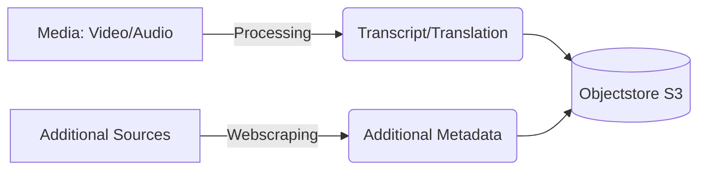
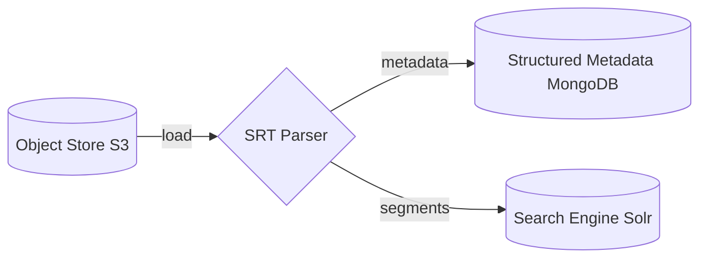
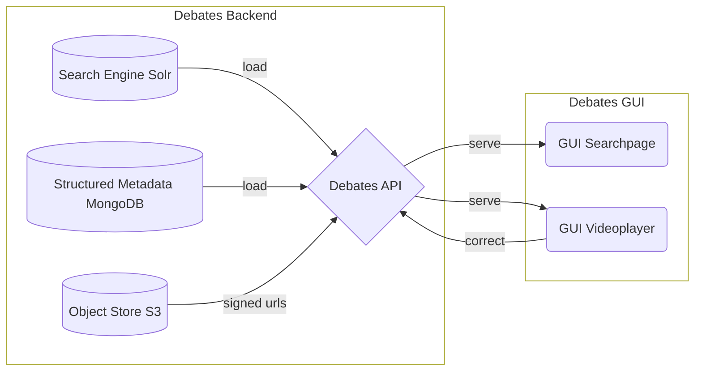

## Architecture

The architecture consists of 3 parts:

- [**processing pipeline**](processing.md): for the video and audio files to derive transcripts translations and additional metadata

- [**loading results into secondary databases**](loading.md): the processed data is loaded into structured databases to improve findability

- [**serving and enriching metadata via a WebUI**](webui.md): the Webui allows to search in the debates and to annotate and correct the speaker statements

