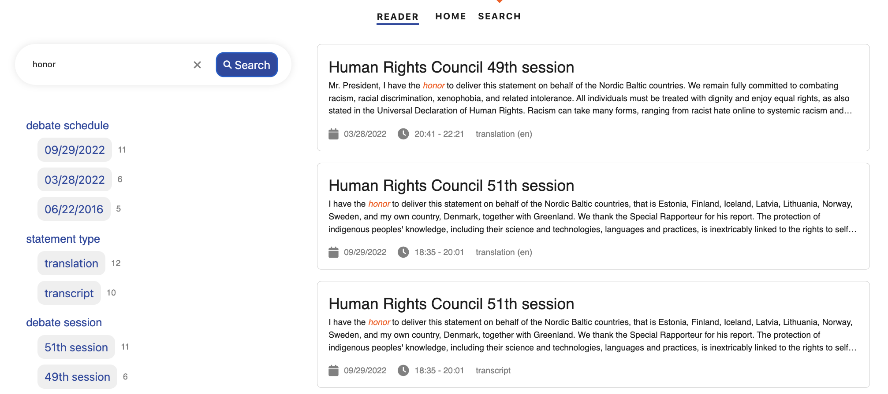

# About

Political Debates is a projects that aims to facilitate analysis of video or audio content in the following ways:

- transcripts and translations are AI generated and split content per speakers
- a user interface is offered to add annotations for the speakers and to correct the AI generated transcriptions and translations
- a search engine that is updated with the modified content helps to find relevant statements of speakers

## Context

The project was developped in the context of analyzing political debate by the UNHCR.
But it can be generalized to other video and audio content, where the focus is on speakers that take turns dicussing a topic.
The input are just video and audio files, with no specific assumptions. The goal is to make the content available per speaker
and to be able to search into who said what when.

## User Interface

The userinterface shows maybe best what has been achieved:

- There is a serch interface, where the videos and audios are searchable by speaker statements in both original language and english translation

- You can jump into the mediaplayer page for each statement and hear/watch the statement while at the same time being able to compare against transcript and translation. You can also edit the speaker, transcript and translation of the statement.

{ width="800", caption="hello" }
/// caption
Search interface to make speaker statements searchable
///

{ width="800" }
/// caption
Videoplayer to compare and edit speaker information, transcripts and translations
///

## PoC

The project has been done as a Proof of Concept: it is not production ready and some steps that can be automated are still manual. Also some settings that could be custom are currently hard coded. In Roadmap we describe the next steps to generalize the project.
