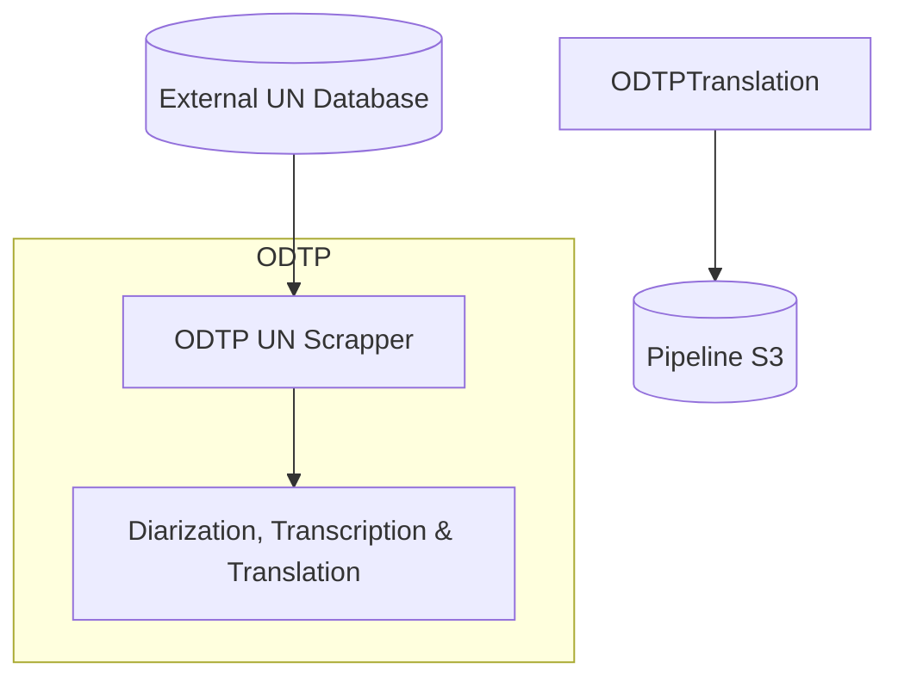
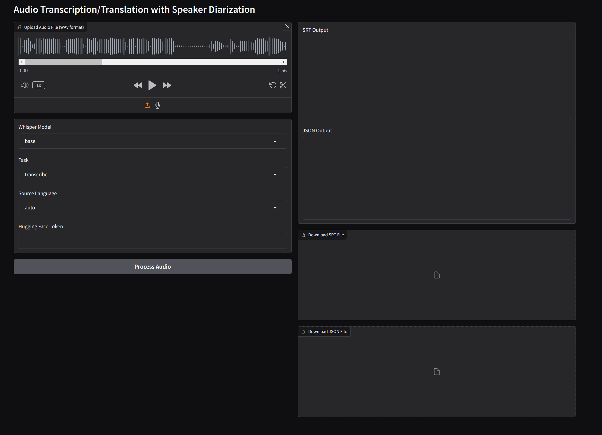

# Processing Pipeline

!!! note

    The pipeline can and has been run so far on a private GPU server

The processing pipeline:



Existing components:

- **ODTP UN Scrapper** [`odtp-unog-digitalrecordings-scrapper`](https://github.com/sdsc-ordes/odtp-unog-digitalrecordings-scrapper). Component to scrap and download metadata from the UNOG Digital Recordings platform.
- **ODTP Pipeline** [`dt-political-debates`](https://github.com/sdsc-ordes/dt-political-debates). Repository compatible with ODTP and able to run the full pipeline 
- **ODTP Pyannote Whisper** [`odtp-pyannote-whisper`](https://github.com/sdsc-ordes/odtp-pyannote-whisper). Component to diarize and transcribe audios and videos

## How to run the pipeline in ODTP?

The easiest way to run the pipeline is to clone the ODTP Pipeline repository and run it in your ODTP instance following these instructions. 

You would need to configure all the parameters, variables, and secrets before doing so. The pipeline will fetch data from the UN Digital Recordings platform and perform transcriptions and translations over all the files in a date range. 

Please be aware that the use of the UN-Digital-Scrapper requires authorisation and an agreement with the UN. This component has been develop under an academic project for educational purposes. 

## How to run the Pyannote Whisper component?

If you wish just to run the Pyannote Whisper component, you can do it by deploying the service in your computer or cloning our [Huggingface Space](https://huggingface.co/spaces/katospiegel/odtp-pyannote-whisper).



This space is running on a CPU which will make the transcription run slow. However, you can clone this space and request the use of GPUs. First you need to create an account in Huggingface.co, clone the space, configure the secrets, and select a GPU-based hardware. 

This pipeline processes a `.wav` or `mp4` media file by detecting the number of speakers present in the recording using `pyannote.audio`. For each detected speaker segment, it employs `OpenAI's Whisper model` to transcribe or translate the speech individually. This approach ensures accurate and speaker-specific transcriptions or translations, providing a clear understanding of who said what throughout the audio.

Note: This application utilizes `pyannote.audio` and OpenAI's Whisper model. You must accept the terms of use on Hugging Face for the `pyannote/segmentation` and `pyannote/speaker-diarization` models before using this application.

- [Speaker-Diarization](https://huggingface.co/pyannote/speaker-diarization-3.1)
- [Speaker-Segmentation](https://huggingface.co/pyannote/segmentation-3.0)

After accepting these terms and conditions for those models. You can obtain you HuggingFace API Key to allow the access to these models: 

- [Hugging Face Access Keys](https://huggingface.co/settings/tokens)

This token should be provided to the component via the `ENV` variables or by the corresponding text field in the web app interface ([Here](https://huggingface.com/spaces/katospiegel/odtp-pyannote-whisper)).

For more information check the README file on [`odtp-pyannote-whisper`](https://github.com/sdsc-ordes/odtp-pyannote-whisper)


## Outputs

### Outputs in S3

The S3 of the Pipeline contains the results for each media file processing: the results are structured in the following way:

```hl_lines="1 2 3 7 10 12"
debates
└── HRC_20220328T0000
    ├── HRC_20220328T0000-files.yml
    ├── HRC_20220328T0000-original.wav
    ├── HRC_20220328T0000-transcription_original.json
    ├── HRC_20220328T0000-transcription_original.pdf
    ├── HRC_20220328T0000-transcription_original.srt
    ├── HRC_20220328T0000-translation_original_english.json
    ├── HRC_20220328T0000-translation_original_english.pdf
    ├── HRC_20220328T0000-translation_original_english.srt
    ├── HRC_20220328T0000.json
    └── HRC_20220328T0000.mp4
```

The operational important outputs are highlighted above and described below:

- `debates`: is the S3 bucket for all outputs
- `HRC_20220328T10000.mp4`: is the original media file that was processed: a prefix is derived from the name `HRC_20220328T10000`. All outputs belonging to the media file are stored under that prefix in the S3
- `HRC_20220328T0000-files.yml`: contains all files with descriptions
- `HRC_20220328T0000-transcription_original.srt`: the SRT file with the transcription
- `HRC_20220328T0000-translation_original_english.srt` the SRT file with the translation. In this case the original audio has been translated to english. 
- `HRC_20220328T0000.mp4`: the media file that is played in the AppUI videoplayer


### JSON File Format

This project has developped a JSON file format that combines metadata with the different transcriptions, translations, and other annotations. This single file. This file includes transcription at a sentence level and facilitates further analysis in Python, R or any other data analysis tool. 

The schema for this file is located [here](https://github.com/sdsc-ordes/dt-political-debates/blob/main/schemas/sampleSchema.json)

One minimal example will looks like this:

```json
{
  "$schema": "https://github.com/sdsc-ordes/dt-political-debates/blob/main/schemas/sampleSchema.json",
  "version": "1.0",
  "metadata": {
    "title": "Annual HPC User Meeting - 2023-05-15 09:30",
    "date": "2023-05-15",
    "time": "09:30",
    "url": "https://meetings.sdsc.edu/hpcuser2023/downloads/session_recordings/2023-05-15_session1.zip",
    "tags": [
      "SD230515A"
    ],
    "summary": "",
    "labels": {
      "Title": "Annual HPC User Meeting",
      "RoomNumber": "Auditorium B",
      "TimeFrom": "2023-05-15 09:30",
      "TimeTo": "2023-05-15 12:00",
      "RecordingStart": "09:32",
      "UniqueNumber": "SD230515A",
      "ClientName": "SDSC Computational Sciences",
      "ClientCode": "90.1011",
      "PrivPubl": "public",
      "Exists": "true",
      "sessionfile": "2023-05-15_09h32.txs",
      "recorded": true,
      "startdate": "2023-05-15",
      "stopdate": "2023-05-15",
      "starttime": "09:32:45",
      "stoptime": "12:02:30",
      "recordingtime": "02:29:45",
      "archivefile": "2023-05-15_09h32.zip",
      "clientname": "CSE Department",
      "meetingNR": "5",
      "privatepublic": "Public",
      "summaryrecords": "True",
      "sessiontitle": "Annual HPC User Group Meeting",
      "lastchunk": "1"
    }
  },
  "channels": [
    {
      "id": "video",
      "type": "video",
      "name": "Primary Video Feed",
      "data": "SDSC_20230515_0930.mp4",
      "tags": [
        "main",
        "video"
      ]
    },
    {
      "id": "original",
      "type": "audio",
      "name": "Raw Audio Stream",
      "data": "SDSC_20230515_0930-original.wav",
      "tags": [
        "original",
        "audio"
      ]
    }
  ],
  "annotations": [
    {
      "id": "markers_annotation",
      "type": "markers",
      "origin": "original",
      "labels": {
        "source": "markers"
      },
      "items": [
        {
          "id": "1",
          "type": "TReX",
          "origin": "original",
          "labels": {
            "type": "TReX",
            "name": "Recording Start",
            "info": ""
          },
          "start_timestamp": "09:32:45",
          "end_timestamp": "09:32:45"
        },
        {
          "id": "2",
          "type": "User",
          "origin": "original",
          "labels": {
            "type": "User",
            "name": "MODERATOR",
            "info": "Opening Remarks"
          },
          "start_timestamp": "09:32:50",
          "end_timestamp": "09:34:00"
        }
      ]
    },
    {
      "id": "transcription_original",
      "type": "audio_transcription",
      "originChannel": "original",
      "labels": {},
      "items": [
        {
          "transcript": "Good morning, everyone. Welcome to our annual HPC user group meeting.",
          "start_timestamp": "00:00:05",
          "end_timestamp": "00:00:10",
          "labels": {
            "speaker": "SPEAKER_01",
            "language": "en"
          },
          "tags": []
        },
        {
          "transcript": "We will start today's session with updates on recent system upgrades.",
          "start_timestamp": "00:00:12",
          "end_timestamp": "00:00:17",
          "labels": {
            "speaker": "SPEAKER_01",
            "language": "en"
          },
          "tags": []
        }
      ]
    },
    {
      "id": "translation_original_spanish",
      "type": "audio_translation",
      "originChannel": "original",
      "labels": {},
      "items": [
        {
          "transcript": "Buenos días a todos. Bienvenidos a nuestra reunión anual del grupo de usuarios de HPC.",
          "start_timestamp": "00:00:05",
          "end_timestamp": "00:00:10",
          "labels": {
            "speaker": "SPEAKER_01",
            "language": "es"
          },
          "tags": []
        },
        {
          "transcript": "Comenzaremos la sesión de hoy con actualizaciones sobre mejoras recientes en los sistemas.",
          "start_timestamp": "00:00:12",
          "end_timestamp": "00:00:17",
          "labels": {
            "speaker": "SPEAKER_01",
            "language": "es"
          },
          "tags": []
        }
      ]
    }
  ]
}
```


### SRT files

SRT is a commonly known Standard for subtitles. Below your see an example of an SRT file. The SRT files that the pipeline  outputs already contain speaker information in form of a speaker IDs such as `SPEAKER_06`. The speaker_ids are derived
by diarization.

```
1
00:00:00,031 --> 00:00:17,811
[SPEAKER_06]:  Pasamos inmediatamente al tema 9, ...

2
00:00:17,811 --> 00:00:31,451
[SPEAKER_06]:  Procedemos ahora a la presentación ...

3
00:00:31,451 --> 00:00:47,751
[SPEAKER_06]:  Tengo el placer de dar la bienvenida ...

4
00:00:47,811 --> 00:00:50,631
[SPEAKER_06]:  Excelencia, querida embajadora, tiene la palabra.

5
00:00:55,145 --> 00:00:57,305
[SPEAKER_00]:  Thank you, Chair Passon.

6
00:00:57,305 --> 00:01:00,525
[SPEAKER_00]:  Excellencies, ladies and gentlemen,

```

## Additonal outputs

Example of `HRC_20220328T0000-files.yml`

```
files:
  - name: HRC_20220328T0000.json
    type: json
    description: JSON file containing metadata transcription ...
  - name: HRC_20220328T0000-files.yml
    type: yml
    description: YAML file containing metadata of the files ...
  - name: HRC_20220328T0000.mp4
    type: mp4
    description: MP4 video file from the 2020 03 28 00:00 session
  - name: HRC_20220328T0000-original.wav
    type: wav
    description: Original audio file from the 2020 03 28 00:00 session
  - name: HRC_20220328T0000-transcription_original.srt
    type: srt
    description: Transcription file in SRT format ...
  - name: HRC_20220328T0000-transcription_original.pdf
    type: pdf
    description: PDF file containing the transcription ...
  - name: HRC_20220328T0000-translation_original_english.srt
    type: srt
    description: Translation file in SRT format to English ...
  - name: HRC_20220328T0000-translation_original_english.pdf
    type: pdf
    description: PDF file containing the English translation ...
```

After the media has been processed it is loaded into the Debates App via the [dataloader](dataloader.md).
