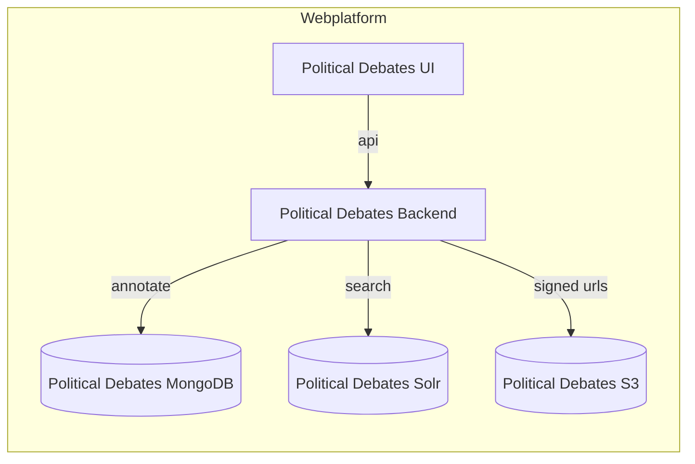
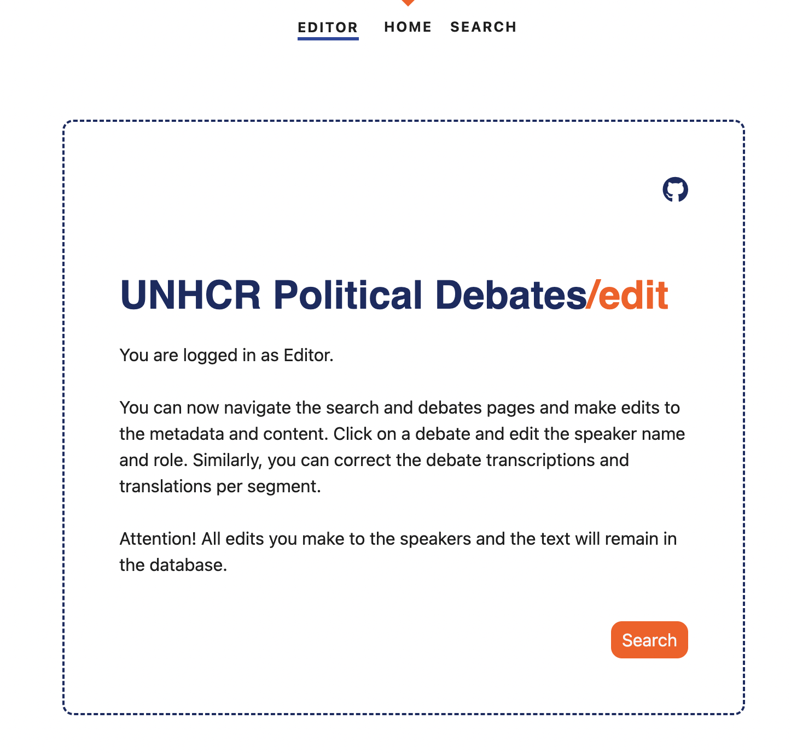
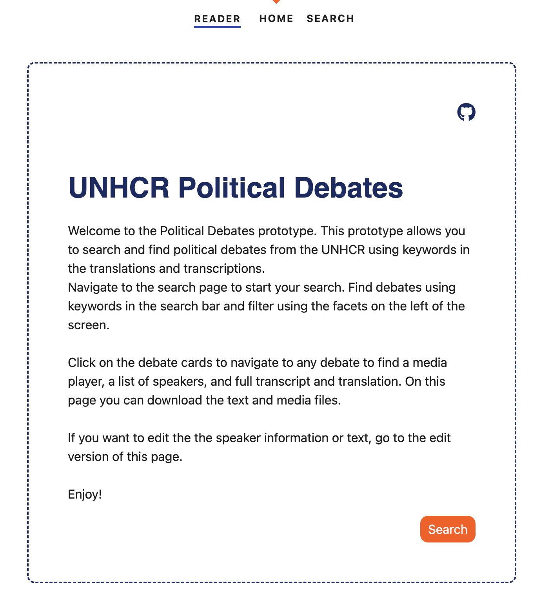

# WebUI

## Architecture

- The User Interface talks to the Backend via API. See [API Documentation](api.md)
- The Web Ui is build with [Sveltekit](https://svelte.dev/)

## User Roles

Currently the User interface has no Authentication added. In a [Server installation](../install/server.md) we installed two password protected users: (see `nginx` folder)

- `reader`: can only view the page
- `editor`: can add annotation on the videoplayer page

You also have these roles in other installation mode, by just going on the routes:

- `/edit`: is the route for the `editor` role
- `/`: switches to the reader role.

## Homepage Editor

{ width="800", caption="hello" }
/// caption
Homepage of the Editor User avaliable at `/edit`
///

## Homepage Reader

{ width="800", caption="hello" }
/// caption
Homepage of the Reader User avaliable at `/`
///

## Search Page

{ width="800", caption="hello" }
/// caption
Search interface to make speaker statements searchable available at `/search`
///

## Mediaplayer Page as Editor

{ width="800", caption="hello" }
/// caption
Videoplayer detail page for the reader user to compare transcripts and translations
///

## Mediaplayer Page as Reader

{ width="800" }
/// caption
Videoplayer detail page for the Editor user: the editor user can correct the transcripts and translations and add speaker name and Role
///
